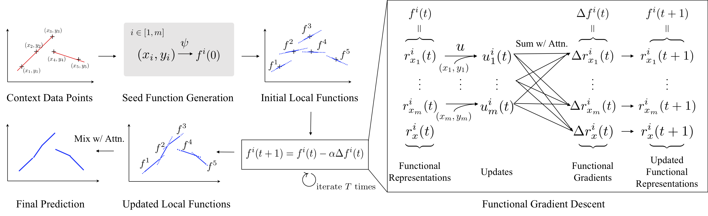

# Local Nonparametric Meta-Learning (MeRLOT)

<p align=center>
  
</p>

This repository contains a code used to conduct experiments reported in the paper.

## Requirements

```
Ubuntu 16.04+ (Tested on 16.04)
Python 3.7+
CUDA 10.1, cudnn 7.6.5
TensorRT 6.0.1.5 (optional, for deterministic results)
```

Required libraries to run this code can be installed via conda:
```
conda env create -f environment.yml
```

## Run

```
python run.py --config_file ./experiments/one_d_regression/<gin_file> --seed <seed> --log_dir <log_dir>
```

## Eval

```
python evals/one_d_regression.py --extra_config_params tasks.one_d_regression.Dataset.task_random_seed=0 --log_dir <log_dir>
```
